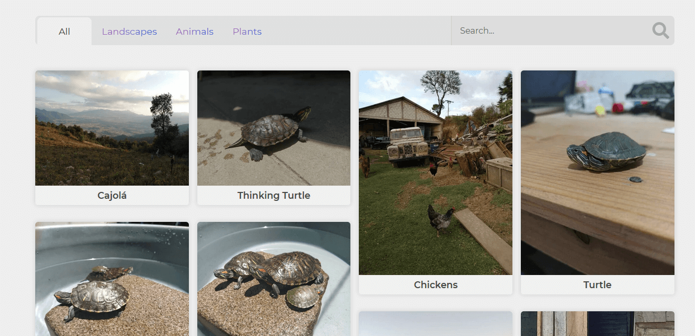

<!-- PROJECT LOGO -->
 

  

  <h3 align="center">Image Gallery</h3>

  

     
    <a href="https://github.com/alejandro-vasquez-es/Gallery-Image"><strong>Explore the docs »</strong></a>
     
     
    <a href="https://alejandro-vasquez-es.github.io/Gallery-Image/">View Demo</a>
  

<!-- TABLE OF CONTENTS -->

  
<h2 style="display: inline-block">Table of Contents</h2>

  <ol>
    <li>
      <a href="#about-the-project">About The Project</a>
      <ul>
        <li><a href="#built-with">Built With</a></li>
      </ul>
    </li>
  </ol>

## About The Project

### Built With

* javascript
* CSS
* HTML

## Contact

Alejandro Vásquez - [@linkedin]https://www.linkedin.com/in/alejandro-v%C3%A1squez-4048a7218/) - alejandrovasquezesc@gmail.com

Project Link: [https://github.com/alejandro-vasquez-es/Gallery-Image](https://github.com/alejandro-vasquez-es/Gallery-Image)
